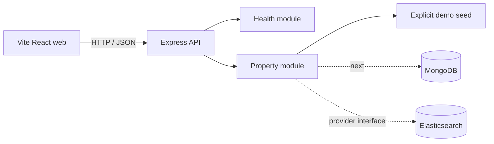

# Architecture

RealStateX is intentionally a modular monolith at its present maturity. HTTP concerns live in `shared`; each product area owns routes, controllers, services, and data access. This keeps domain boundaries extractable without paying the operational cost of premature microservices.

Public pages are responsive and progressively enhanced. The hero uses video metadata and direct DOM updates in a requestAnimationFrame loop so scrolling does not cause React render churn. Reduced-motion users receive a static architectural composition.

API responses use a stable envelope and request ID. Security middleware includes Helmet, strict CORS, request limits, signed cookies, compression, and rate limiting. Secrets remain environment-only.
